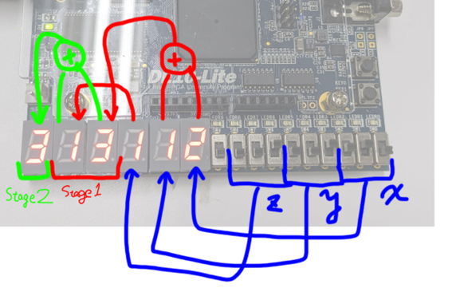

# FPGA_demo
本リポジトリは、イチケンが下の動画を制作するにあたって開発したソースコードを公開するためのリポジトリです。  

  

動画内で使用したFPGAのデモンストレーションで使用したソースコードのほか、動画内で使用しなかった試作品のコードも含まれます。  
ぜひ参考にしてみてください。
# 使用機材
FPGAボードは[DE-10Lite](https://www.digikey.jp/ja/products/detail/terasic-inc/P0466/6230089)を使用しています。  

# 1. 5bitFullAdder(5bit加算器)
5bit+5bitの全加算器です。  
FPGA本体のスライドスイッチSW0~4,5~9をそれぞれ入力に使用し、入力された値を加算器回路によって加算します。  
計算結果はLED0~5に表示します。  

# 2. pipeline(パイプライン処理)
一つのプロセッサは同時に(同一クロック内に)一つの処理しか実行できません。  
それに対して、FPGAは“回路”なので、処理内容ごとに対応する回路も異なる。そのため、別の手順を同時に実行することができます。  
そこで、手順ごとにクロックをずらして複数の処理を同時に実行することをパイプライン処理と呼びます。  
プロセッサによる処理よりもスループットを上げることができます。

今回の作例では、以下の図のように、Stage1,2の2段階の処理を同時にパイプライン処理で実行します。  
  
x,y,zの3つの数を2段階に分けて足す処理をします。  
詳細は動画をご覧ください。  

KEY1を押すとStage1,2のすべての変数を0にリセット。  
KEY2を押すとクロックが入力され、処理が1段階進みます。  
KEY2にはチャタリング対策回路を実装しています。

# 3. sequential(逐次処理)
逐次処理を疑似的に再現したプログラムでパイプライン処理と同様に3つの数の足し算をします。  
ただ、現在実行されている計算が完了するまで次の計算が開始されません。  
パイプライン処理によりスループットが向上するという比較のために作成しました。  

# 4. matrix
2*2の行列同士の乗算を論理演算によって行います。  
以下のような動作が実装されています。  
- 行列A,Bを格納する配列変数と、それを乗算した結果を代入する変数、その計算を行う回路を用意する
- 入力は二つ。リセットボタンと配列代入ボタン。
- リセットボタンを押すと、行列Aにあらかじめ決めた適当な数値が代入される。また、行列Bには単位行列が代入される。
- 配列代入ボタンを押すと、行列Bの内容があらかじめ決めた適当な数値に書き換えられる。
- 計算結果の出力は、10進法での下1桁を10進デコーダに入力し、7セグ表示に変換して表示する。

# 5. sort(バイトニックソート)
FPGAを利用したソートプログラムです。   
本プログラムではバイトニックソート(Bitonic Sort)というアルゴリズムを採用しています。これは、並列処理によって速度向上が見込めるアルゴリズムです。  
バイトニックソートにおいて、要素数は2のべき乗である必要があります。  
本プログラムでは、要素数Nをパラメータとして渡すことができます。作例中ではN=16として予めランダムに決めた並びの数を与えています。
7セグLEDには、昇順に下から6個の要素の、10進法での下1桁を表示しています。  

KEY0を押すとリセット(あらかじめ決めたランダム並び)。  
KEY1を押すとソートが実行されます。  

ソート開始とソート完了のタイミングでGPIOに信号を出力します。  
それをオシロで観察することで、ソートの実行時間を計測することができます。  
マイコンなどのプロセッサを利用した計算機と速度を比較する予定でした。  

